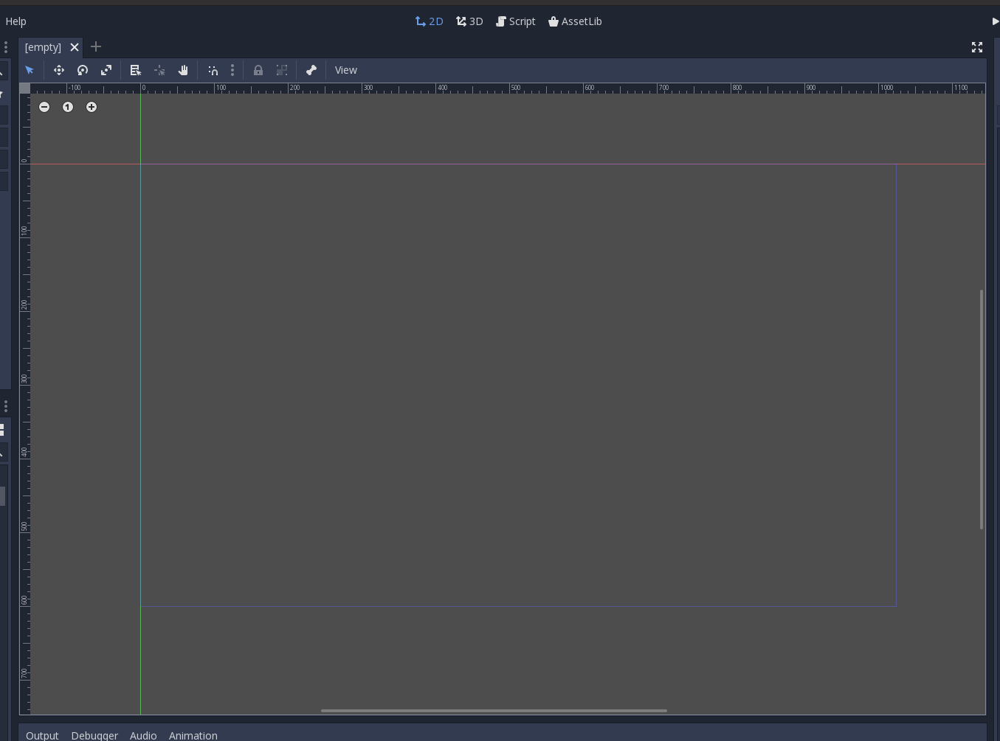
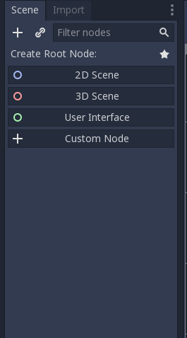
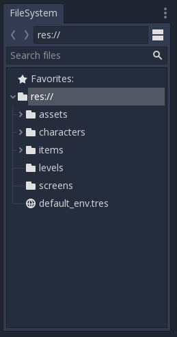
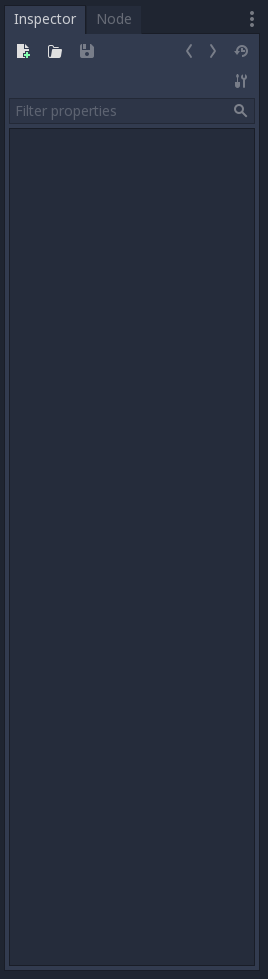
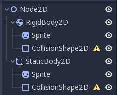
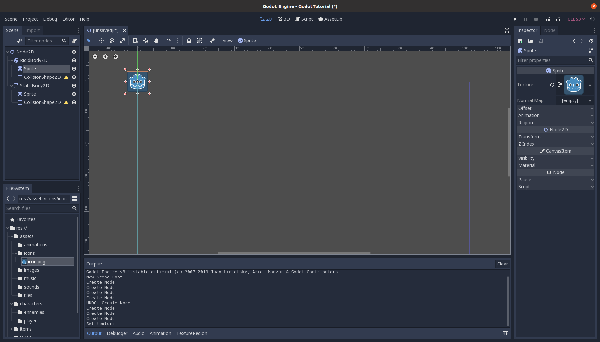
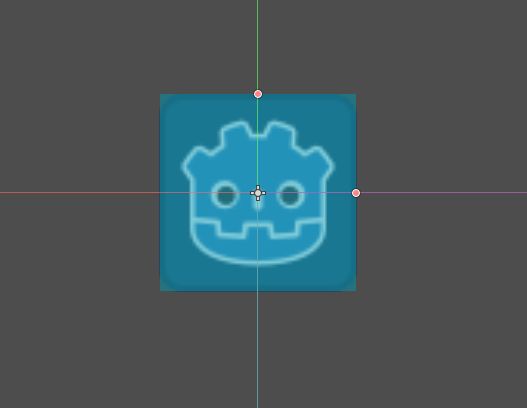
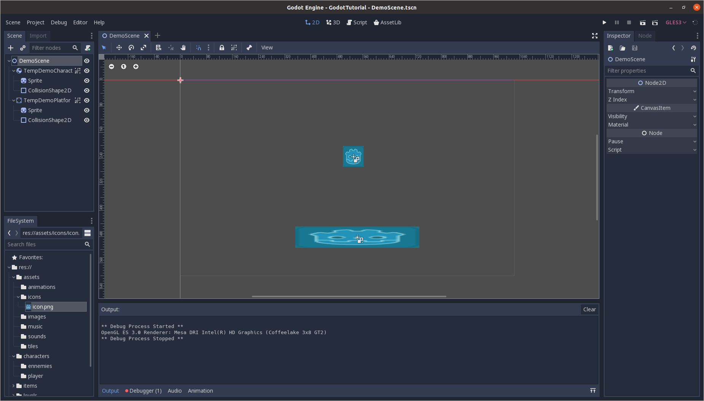

<h1 align="center">GODOT ENGINE - PLATEFORMER TUTORIAL</h1>

_<h5 align="center">Learn how to make a game with the Godot Engine.</h5>_

**<h2 align="center">1 - Getting Started with Godot</h2>**

### Requirements

Before following this course, if you are using this project as source code, run the following command :

```bash
❯ git checkout 1-Getting-started-with-godot
```

### Summary

In this part we are going to see :

- What are the purposes of each pannels in the Godot Game Engine
- How to nodes work in Godot
- How create our first scene and objects

### Quick tour of Godot

The Godot window can be divided into two main sections :

- The viewport in which we are going to edit our scenes and our scripts
- The docks in which we our going to create our nodes and edit our parameters

**Viewport**

The main view is the viewport. According to what we are going to edit, wether it is our levels or our scripts, this is the area that we will manipulate.



At the top of the viewport, you can see several options, such as select, move, rotate, scale, and others, that will come handy when manipulating our objects within our window.

**Node dock**

The node dock is probably the most use dock in the application. This is where we are going to manipulate our objects hierarchy, in order to construct our scenes and levels, add properties to our objects, select the instances of the object that we want to manipulate, etc...



At the top of the scene, the chain icon is the button we are going to use in order to import objects in our scene.

**File system**

The file system is the place where we can select our elements to access them. It is also a useful help in order to know your project architecture.



It will be aspecially usefull when we will need to import our assets, as we will drag and drop them into our properties.

**Inspector**

The inspector is the section where we will edit our objects properties. It is also in the inpector that our custom properties will be added for our objects.



**Tool Bar**

From left to right :

- The properties of our project
- The viewport navigation controller
- The game/scenes play button


> Before you go on to the next part, I strongly suggest you get familiar with all the dock's names in order not to be confused when they will be mentionned in the following parts of the course.

### Create a first scene

**Our first nodes**

Now that we know where to go in the game engine, it's time to create our first scene.

In the `node` dock, we are going to click on `2d scene`, and add two child nodes :

- A RigidBody2D
- A StaticBody2D

> The 2D nodes are represented in blue, and the 3D nodes are represented in red. As we are creating a 2D plateformer, all the nodes used should always be blue for our game objects.

For each child nodes, we are going to add two child nodes, a `Sprite` node, and a `CollisionShape2D` node.  
If you did well, you should obtain the following tree :



> Don't worry about the warning, we'll fix it later

**Objects, sprites, and collision shapes**

For now, we can't see our objects, let's add some sprites to them.

> Do all the following steps for one object then the other, otherwise you won't be able to see the two.

Let's start by our `RigidBody2D` object.

To do that, select the `sprite` node in the `node` dock, and let's drag and drop our [Godot character](assets/icons/icon.png) from our `filesystem` to our sprites nodes, in the `texture` property in the `inspector`.

We now can see our character !



Now let's deal with the warning of the `CollisionShape2D`, by clickin on it. In the `inspector`, click on the `shape` property, and select `New RectangleShape2D`.

A square should have appeared on your character, by draging the points, we can adjuste the collision area to match the size of our character.



Let's move away our character in order to leave some space to create the plateform, **but don't move the object just yet !** They are not bind together, and if you move the sprite, the collision shape or the root node, you will offset them.

Before you move them, you must click on the following button in your control pannel, above your viewport, make sure you have your base node selected (the `RigidBody2D` node).


You can save this object, move it, and repeat the instructions for the other object.

> Scale the sprite, and the collision shape to create a large plateform.

If you followed all the steps, you should be having a window looking like the following :



**Time has come to finally run our scene !**

To do that, click on the play scene button at the top right hand corner of your window.


> When you'll run the scenes, be carefull on which scene is beeing selected before you run it.

If you see a window pop up, and your character following until it reaches the plateform, **CONGRATULATION ! YOU MADE YOUR FIRST GAME !** Not that he is very intersting right now, but it's already a good start.

> If you didn't get the expected result, go back earlier in this tutorial to see if you didn't miss any step.

### Create our first objects

You just experimented with your first scenes and objects, but our games would be extremely complicated to create if every objects was created all the time in each levels.

This is why we our going to recreate the objects in separated scenes, and then import them in our demo scene.

**More scenes**

In Godot, everything is a scene. Therefor, we are going to create to more, but this time by right clicking each objects and selecting the `Save branch as scene`. Select the location at which you want to save your scene.

When we will create a new object in this scene, we will create a new scene, and use the `CustomNode` to select the root node of our object.

To import the objects in our levels, we will click on the `Instance a scene file as node` button.


### Conclusion

**Let's summer up what we learned :**

- **In Godot, every object is a scene containing a tree of nodes**
- **To create a new objet, we need to create a custom node at the root of our tree**
- **To import our objects, we need to instanciate them as nodes in our scenes**
- **Objects need sprites to be visible, and collision shapes to interact with each other.**

**In the [next part](https://github.com/Anatole-DC/godot_plateformer_tutorial/tree/2-Player-movements), we will see how to create our first player, and implement the basics movements.**