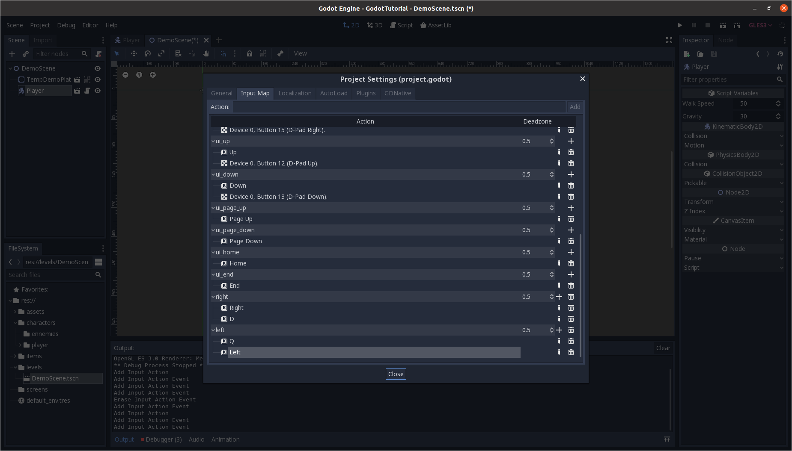

<h1 align="center">GODOT ENGINE - PLATEFORMER TUTORIAL</h1>

_<h5 align="center">Learn how to make a game with the Godot Engine.</h5>_

**<h2 align="center">2 - Implementing player movements</h2>**

### Requirements

Before following this course, if you are using this project as source code, run the following command :

```bash
❯ git checkout 2-Player-movements
```

### Summary

In this part we are going to see :

- How to create a new player object
- How to create our first script
- How to implement left and right movements

> From this part to the end of the tutorial, there will be less images and the code will be created into code sections.  
> If you feel lost, our you find some words that do not ring any bells to you, see the previous part of this tutorial.

### Create our player object

Let's implement a basic player object. It will be compose as such :

- A `KinematicBody2D` as a root node
- A `Sprite` (like our demo character in the previous chapter)
- A `CollisionShape2D` that matches the sprite size.

> The `Sprite` will be switched by an `AnimatedSprite` later in the course, but we will start with a simple sprite at first.

### Attach a script to our player

Click the script button above the node dock, to attach a new script to the object, you can leave all the settings by default, except for the `template` where you can select `No comments` if you don't want to be bothered by the comments that are added by default.

You should land on the script page with the following content :

```gd
extends KinematicBody2D

func _ready():
	pass
```

The `ready()` function is the method called when the object is created. It is only called once.

We are going to add a new nativ function called `_physics_process(delta)`. This function is the function called on each game iteration (frame), and will be the most used function in our game. Paste the following code before running your game to check the behavior of the function.

```gd
var iteration = 0

func _physics_process(delta):
	print("Hello World {iteration}".format({"iteration": iteration}))
	iteration += 1
```

> For the print, the {iteration} is then replaced by the value passed in the format following the string.

If you run the game, you can see the message printed in your console, with the increment. This means that your script is working.

```bash
...
Hello World 185
Hello World 186
Hello World 187
Hello World 188
Hello World 189
Hello World 190
Hello World 191
...
```

### Left and right movements

To implement left and right movements we are going to add two conditions to check if the player pressed either the left or right keys.

```gdscript
export var WALK_SPEED = 50		# Player walk speed
export var GRAVITY = 30			# Player gravity strength

var velocity = Vector2(0, 0)

func _physics_process(delta):
	
	# Right movement
	if Input.is_action_pressed("right"):
		velocity.x = WALK_SPEED
		
	# Left movement
	elif Input.is_action_pressed("left"):
		velocity.x = -WALK_SPEED
		
	velocity = move_and_slide(velocity)
```

Before we talk about keyboard inputs, let's talk about the first two lines. The `export` keyword will add the variable as an object property in the `inspector`.

The `var` keyword is used to define a mutable variable. If you want to define a constant, use the `const` keyword.

And the `move_and_slide` is the function that moves the player in the space.

**Manage inputs**

If you run your scene, you will notice that nothing appends. This is because the `left` and `right` actions mean nothing to the game right now.

To add them, go in you `Project/Project Settings/Input Map` window. In there, you can add the actions that we previously mentionned, and by clicking the `+` and `Key` you can bind as many key as you want on the action that you've created.



> Be careful not to misspell your action, and not to bind the same key on two similar actions in your game.

If you run your scene, you will notice that the character is moving, but it won't stop. To fix this, we need to reset the `velocity.x` value.

We could just assign `0` to the value at the end of the function, but that would lead to a rather rough end of movement in our game. To implement a smoother stop, we are going to call another function called `lerp`.

```gdscript
velocity.x = lerp(velocity.x, 0, 0.3)
```

It will progressively stop our player according to the weight parameter at the end (the smaller, the smoother).

> As we exported the variable, we can change the speed value directly from the inspector pannel.

### Gravity and jumps

To add the jump, we are going to add some gravity to the game, to first make our player fall in our scene. To do that, we need to add a single line to our function.

```gdscript
velocity.y += GRAVITY
```

Here, the `+=` will add `GRAVITY` to the value that was previously store in `velocity.y`, which will cause the movement to accelerate with the fall.

Add that's all there is to add to make our player fall !

> Be careful ! If you didn't add the `velocity = move_and_slide(velocity)` like said, it won't reset the `velocity.y` value, and cause it to increase rappidly ! Your player would instantly disappear if you would walk off a plateform.

We are going to create a new variable called `JUMP_FORCE`, and add a new input called `jump` on which we can bin our jump key.

Here is the updated code.

```gdscript
extends KinematicBody2D

export var WALK_SPEED = 50		# Player walk speed
export var GRAVITY = 50			# Player gravity strength
export var JUMP_FORCE = -1000

var velocity = Vector2(0, 0)

func _physics_process(delta):
	
	# Right movement
	if Input.is_action_pressed("right"):
		velocity.x = WALK_SPEED
		
	# Left movement
	elif Input.is_action_pressed("left"):
		velocity.x = -WALK_SPEED
		
	if Input.is_action_just_pressed("jump") and is_on_floor():
		velocity.y = JUMP_FORCE
	
	velocity.y += GRAVITY
	
	velocity = move_and_slide(velocity, Vector2.UP)
	
	velocity.x = lerp(velocity.x, 0, 0.3)
```

You will noticed that we are calling the `is_on_floor` method, which checks if we are on the floor to perform a jump. To tell the game what direction is related to the floor, we add a `Vector2.UP` to the `move_and_slide` function.

Finally, we add a negative value to the `velocity.y` because in Godot, the y axis is pointing to the bottom of the screen.

**Congratulation ! You now have the bases to make a character move and jump !**

### Conclusion

**Let's summerize what we learned :**

- **To detect player Input, you need to edit the `Project/Project Settings/Input Map` window**
- **To create a variable, use the `var` keyword, and to make it an inspector editable property, use the `export` keyword in front of the variable**
- **Use the `move_and_slide` function to make your player move. It takes a `Vector2` that you can add to the character as a variable, to then edit and increase the value, to make the player move**

**In the [next chapter](https://github.com/Anatole-DC/godot_plateformer_tutorial/tree/3-Level-design) we are going to improve the level design of our game.**