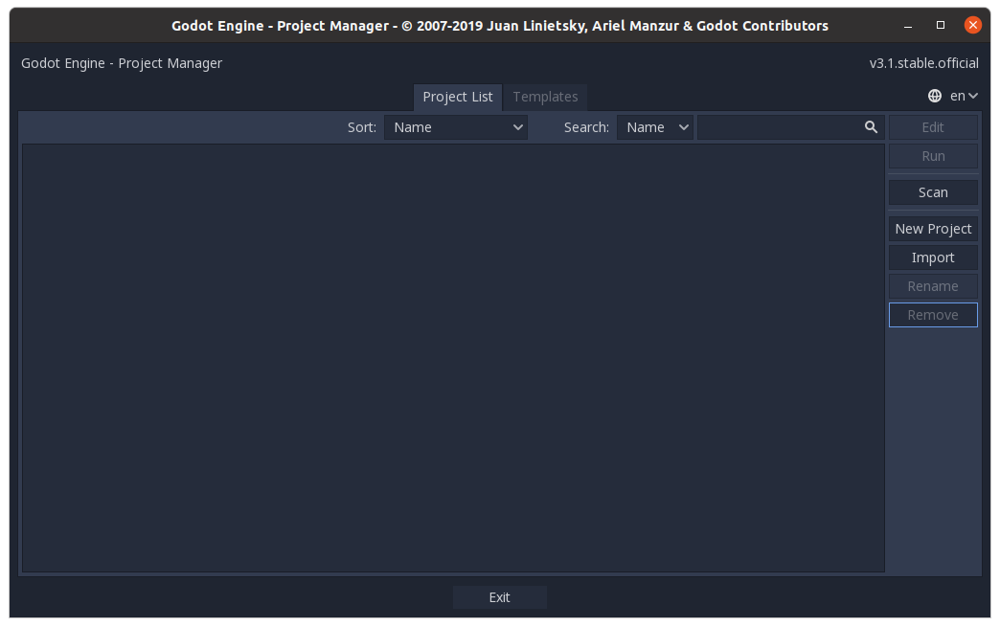
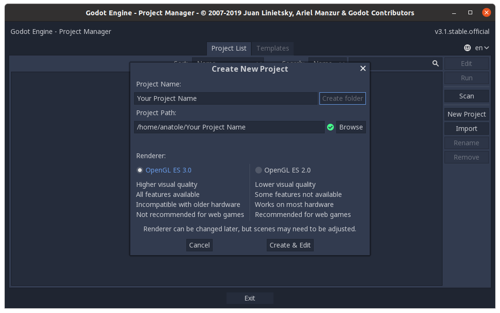
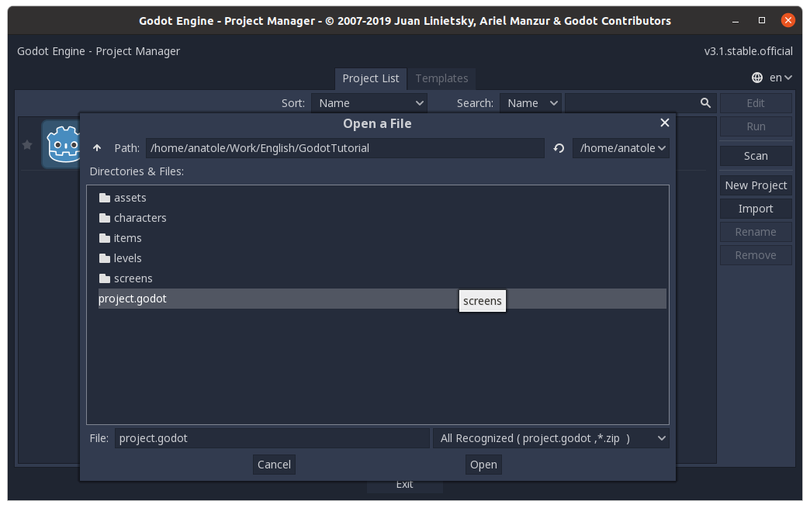

<h1 align="center">GODOT ENGINE - PLATEFORMER TUTORIAL</h1>

_<h5 align="center">Learn how to make a game with the Godot Engine.</h5>_

**<h2 align="center">0 - New Empty Project</h2>**

### Summary

In this part we are going to see :

- How to install Godot on your local machine
- How to create/setup your new project
- How to use git with you project

### Install Godot

Godot does not come with an installer but as an executable. To download it, go to the [godot]() download page, and download the `64-bit Standard` version of Godot.

It will download a zip file, in which you will find the executable.

> For Linux users, it might be easier to use the `sudo snap install godot --classic` command.

Double click on the executable to run Godot.

### New Project

You should land on this window.



Click on `New Project` and create your new Godot game.

> Aside from the game name and location, you should leave the remaining parameters with the default value.



If you want to use the same project as this repository, start by cloning it to your working folder.

```bash
❯ git clone https://github.com/Anatole-DC/godot_plateformer_tutorial.git
```

Then import the project by clicking the `Import` button, and selecting the `project.godot` file in the project directory.



### Git

If you want to setup git with you project, you can copy the [.gitignore](.gitignore) file of this repository and paste it in your project root.

You can run the `git init` command at the same location.

> Warning ! Do not forget to add the .gitignore, otherwise, it might break your repository !

### Conclusion

**Congratulation, you are now able to create/import and setup a Godot project !**

**In the [next part](https://github.com/Anatole-DC/godot_plateformer_tutorial/tree/1-Getting-started-with-godot), we are going to learn the different usage of the Godot's pannel, and how to create our firts scene.**