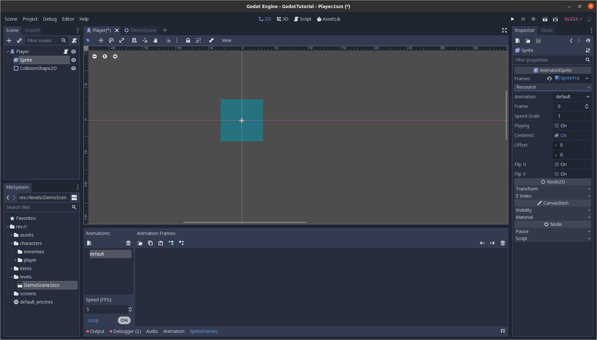
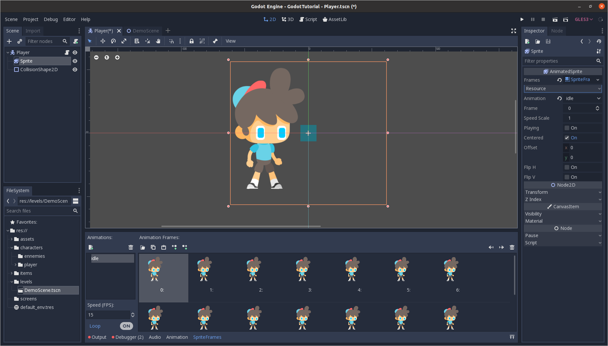

<h1 align="center">GODOT ENGINE - PLATEFORMER TUTORIAL</h1>

_<h5 align="center">Learn how to make a game with the Godot Engine.</h5>_

**<h2 align="center">3 - Sprites animations and Tiles</h2>**

### Requirements

Before following this course, if you are using this project as source code, run the following command :

```bash
❯ git checkout 3-Sprites-and-animations
```

### Summary

In this part we are going to see :

- How to add an animation to the player
- How to change animation according to the action
- Add tileset to create good looking plateforms

### Animations

**Import the sprites**

The first step is going to be importing the sprites into the game engine. If you don't have any sprites, you can find some free assets on [itch.io](https://itch.io/game-assets/free), or use the sprites of the project [here](assets/animations/player).

**Load the idle animation**

The idle animation is the animation ran when the player is not moving. Let's select our player scene, and replace our sprite by an `AnimatedSprite` (you can right click on the `Sprite` and click on `change sprite to`).

In the inspector, in the `frames` parameter, click on `new SpriteFrames`, and click again on the `SpriteFrames`. A new dock should pop up benith the viewport.



You can rename `default` to `idle` and click on the folder to load your sprites.



You can check if the animation is loaded by checking the `Playing` option in the inspector, and you can change the speed of the animation by changing the FPS in the left part of the animation dock. If you are not satisfied with the size of your assets, you can change it in the inspector pannel.

> You can create as much animations as you want in your game, in this course, we will implement the following animations : `running`, `jumping`, and `dying`.

**Add the animations in the script**

To add the animation, we are going to edit the player script. In order to access a node in the object node tree, we use the '`$`' sign to access the node, and if you want to access subnodes, you can separate your node path with a '`/`'.

> In my node tree, I interpolated a `Position2D` because my sprites where to large, so the flip position was behaving weirdly, but I placed the line you can use, if you only have an animated sprite.

We use the `play` method of the Sprite node, to run the animation we want, and according to the direction, we flip the sprite on the horizontal axis.

```gdscript
func _physics_process(delta):

	# Right movement
	if Input.is_action_pressed("right"):
		velocity.x = WALK_SPEED
		$Position2D.scale.x = 1
		# $Sprite.flip_h = false
		$Position2D/Sprite.play("walk")

	# Left movement
	elif Input.is_action_pressed("left"):
		velocity.x = -WALK_SPEED
		$Position2D.scale.x = -1
		# $Sprite.flip_h = true
		$Position2D/Sprite.play("walk")

	else:
		if is_on_floor():
			$Position2D/Sprite.play("idle")

	if not is_on_floor():
		$Position2D/Sprite.play("jump")

	# Jump movement
	if Input.is_action_just_pressed("jump") and is_on_floor():
		velocity.y = JUMP_FORCE

	# Player fall
	velocity.y += GRAVITY

	# Update the player position
	velocity = move_and_slide(velocity, Vector2.UP)
	velocity.x = lerp(velocity.x, 0, 0.3)		# Stops the object with a smooth movement
```

If you followed every steps, you should have a player that is animated on the screen.

### Tiles

Most of the game engines today include a tileset feature. `Tiles` are a set of sprites, attach to one object. We can then select tiles to "paint" our level, with visual elements, that will all have the same property.

**New Tileset**

Let's create a new scene, with a `TileMap` as a root node. Click on the `New TileSet` in the `tileset` property in the inspector, and click on it again to open the tileset dock at the bottom of the viewport.

### Conclusion

**Let's summerize what we learned :**

